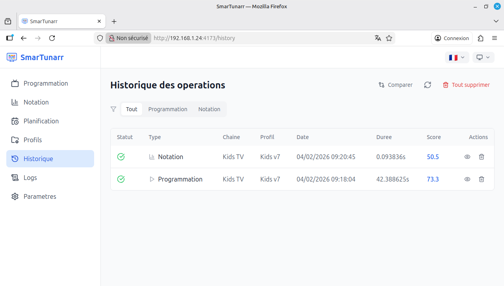
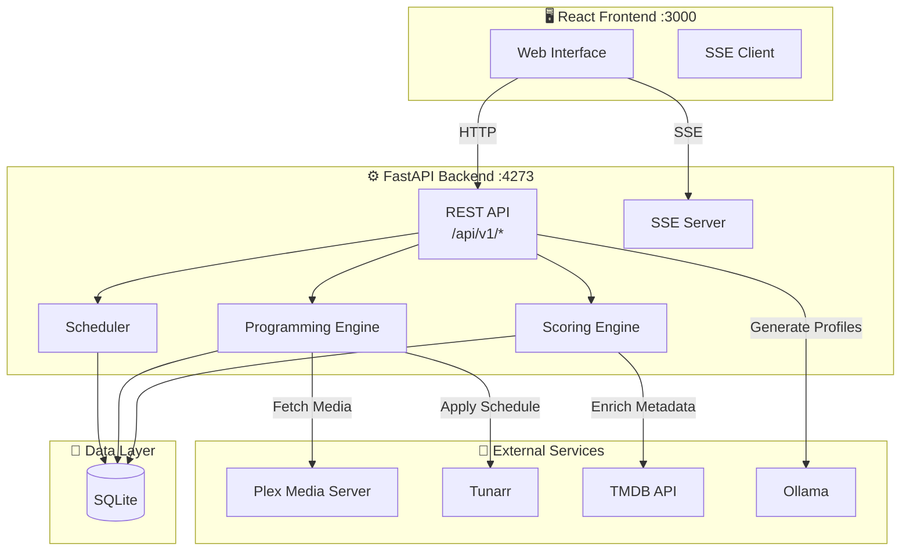
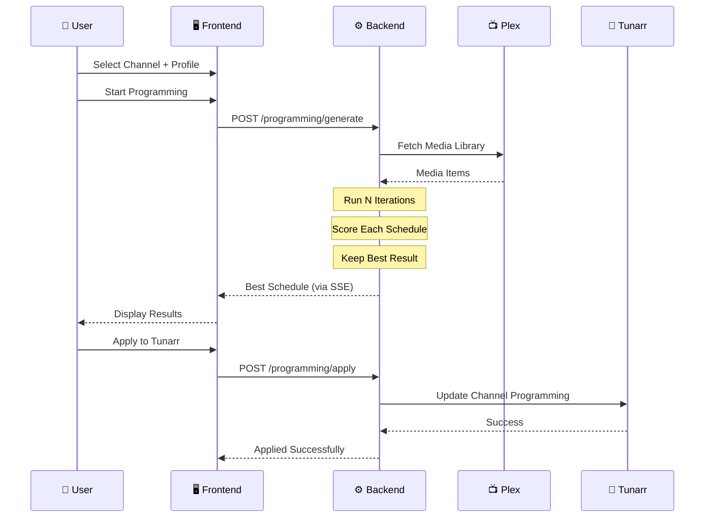

<div align="center">


**Smart TV Channel Programming for Tunarr**

[](https://github.com/sharkhunterr/smartunarr/releases)
[](https://hub.docker.com/r/sharkhunterr/smartunarr)
[](https://hub.docker.com/r/sharkhunterr/smartunarr)
[](LICENSE)

[](https://python.org)
[](https://fastapi.tiangolo.com)
[](https://reactjs.org)
[](https://typescriptlang.org)
[](#-multi-language-support)


**[Quick Start](#-quick-start)** •
**[Features](#-features)** •
**[Docker Hub](https://hub.docker.com/r/sharkhunterr/smartunarr)** •
**[Documentation](docs/)** •
**[Screenshots](#-screenshots)**

</div>

---

## 🚀 What is SmarTunarr?

SmarTunarr is an intelligent TV channel programming system for [Tunarr](https://github.com/chrisbenincasa/tunarr). Generate optimized channel schedules using JSON profiles, AI-assisted generation, and multi-criteria scoring.

**Perfect for:**
- 📺 Tunarr users wanting automated channel programming
- 🎯 Content curators with specific scheduling requirements
- 🤖 Enthusiasts leveraging AI for profile generation
- 📊 Those seeking data-driven schedule optimization

> [!WARNING]
> **Vibe Code Project** - This application was built **100% using AI-assisted development** with [Claude Code](https://claude.ai/claude-code) (Anthropic's CLI). See [Acknowledgments](#-acknowledgments) for details on why and how.

---

## ✨ Features

<table>
<tr>
<td width="33%" valign="top">

### 📋 Profile-Based Programming
**JSON-powered scheduling**
- Define time blocks with criteria
- Content type filtering (movies, episodes)
- Genre, age rating, studio filters
- Duration constraints
- Bonus scoring conditions

[Profile guide →](docs/USER_GUIDE.md#profiles)

</td>
<td width="33%" valign="top">

### 🎯 9-Criterion Scoring Engine
**Multi-factor optimization**
- Type matching
- Duration fitting
- Genre alignment
- Timing optimization
- Strategy compliance
- Age rating checks
- TMDB rating thresholds
- Filter validation
- Bonus conditions

[Scoring details →](docs/USER_GUIDE.md#scoring)

</td>
<td width="33%" valign="top">

### 🤖 AI Profile Generation
**Ollama-powered intelligence**
- Natural language → JSON profile
- Modify existing profiles with AI
- Multiple model support
- Local LLM (no cloud required)

[AI features →](docs/USER_GUIDE.md#ai-generation)

</td>
</tr>
</table>

### 🎨 Modern Web UI
- 🌐 **5 languages** (EN, FR, DE, ES, IT)
- 🌓 Light/Dark/Auto themes
- 📱 Fully responsive design
- 📊 Real-time progress tracking
- 📜 Execution history with details

### 🔌 Service Integration
- **Plex**: Media library source
- **Tunarr**: Channel management & programming
- **TMDB**: Metadata enrichment & ratings
- **Ollama**: Local AI model inference

---

## 🏃 Quick Start

### Option 1: Docker (Recommended)

```bash
# Pull the latest image
docker pull sharkhunterr/smartunarr:latest

# Run with Docker Compose
curl -o docker-compose.yml https://raw.githubusercontent.com/sharkhunterr/smartunarr/master/docker/docker-compose.yml
docker compose up -d
```

**Access**: http://localhost:3000

📖 **[Complete Docker guide →](docker/README.md)** | **[Docker Hub →](https://hub.docker.com/r/sharkhunterr/smartunarr)**

### Option 2: Local Development

```bash
# Clone and setup
git clone https://github.com/sharkhunterr/smartunarr.git
cd smartunarr
npm run setup

# Start dev servers
npm run dev

# Access
# Frontend: http://localhost:5173
# API docs: http://localhost:4273/docs
```

📖 **[Development guide →](docs/DEVELOPMENT.md)**

---

## 🔧 Configuration

SmarTunarr requires minimal configuration to get started:

```yaml
# docker-compose.yml
environment:
  - LOG_LEVEL=INFO
  - DATABASE_URL=sqlite+aiosqlite:///./smartunarr.db
  - PLEX_URL=http://your-plex-server:32400
  - PLEX_TOKEN=your_plex_token
  - TUNARR_URL=http://your-tunarr-server:8000
```

After first launch:
1. Navigate to **Settings**
2. Configure **Plex** connection (URL + token)
3. Configure **Tunarr** connection
4. (Optional) Add **TMDB** API key for metadata
5. (Optional) Configure **Ollama** for AI features

📖 **[Configuration guide →](docs/CONFIGURATION.md)** | **[User guide →](docs/USER_GUIDE.md)**

---

## 📸 Screenshots

<details open>
<summary><b>📺 Programming & Scoring</b></summary>

| Programming | Scoring Analysis |
|-------------|------------------|
|  |  |

</details>

<details>
<summary><b>📋 Profiles & AI Generation</b></summary>

| Profile Editor | AI Generation |
|----------------|---------------|
|  |  |

</details>

<details>
<summary><b>⚙️ Settings & History</b></summary>

| Settings | History |
|----------|---------|
|  |  |

</details>

**[View all screenshots →](docs/images/)**

---

## 📚 Documentation

| Guide | Description |
|-------|-------------|
| [Installation](docs/INSTALLATION.md) | Complete setup instructions |
| [Docker](docker/README.md) | Docker deployment guide |
| [Configuration](docs/CONFIGURATION.md) | Environment & service config |
| [User Guide](docs/USER_GUIDE.md) | Complete UI guide, profiles & scoring |
| [API Reference](docs/API.md) | REST API endpoints |
| [Development](docs/DEVELOPMENT.md) | Developer guide & architecture |
| [Scripts](scripts/README.md) | Release automation & CI/CD |

---

## 🌐 Multi-Language Support

SmarTunarr is fully translated into **5 languages**:

🇬🇧 English • 🇫🇷 Français • 🇩🇪 Deutsch • 🇪🇸 Español • 🇮🇹 Italiano

All translations generated with Claude Code. Want to add a language? See [Development Guide](docs/DEVELOPMENT.md#internationalization).

---

## 🛠️ Technology Stack

**Backend**: Python 3.11 • FastAPI • SQLAlchemy • Alembic • Pydantic

**Frontend**: React 18 • TypeScript • Tailwind CSS • Vite • i18next

**DevOps**: Docker • GitLab CI • GitHub Actions

**[Architecture details →](docs/DEVELOPMENT.md#architecture)**

---

## 🏗️ Architecture

### System Overview



### Programming Flow



---

## 🤝 Contributing

Contributions welcome! Please:

1. Read the [Development Guide](docs/DEVELOPMENT.md) for architecture details
2. Fork and create a feature branch
3. Run tests: `npm run lint && npm test`
4. Submit a pull request

**Releases**: We use automated release scripts. See [Scripts documentation](scripts/README.md) for details.

---

## 📦 Releases & Docker

### Latest Release

Check [Releases](https://github.com/sharkhunterr/smartunarr/releases) for changelogs and downloads.

### Docker Images

```bash
# Latest stable
docker pull sharkhunterr/smartunarr:latest

# Specific version
docker pull sharkhunterr/smartunarr:v0.1.0
```

**Platforms**: `linux/amd64`, `linux/arm64`

**[Docker Hub →](https://hub.docker.com/r/sharkhunterr/smartunarr)** | **[Release automation →](scripts/README.md)**

---

## 🙏 Acknowledgments

**The Need**: Creating optimal TV channel schedules manually is time-consuming and repetitive. Tunarr provides great channel management, but lacks intelligent scheduling based on content criteria.

**The Solution**: SmarTunarr automates TV programming using customizable profiles, multi-criteria scoring, and AI-assisted profile generation.

**The Approach**: Built entirely through [Claude Code](https://claude.ai/claude-code) using "vibe coding" — pure conversation, no manual coding required.

Special thanks to:
- [Tunarr](https://github.com/chrisbenincasa/tunarr) - IPTV channel manager
- [Plex](https://www.plex.tv/) - Media server
- [TMDB](https://www.themoviedb.org/) - Movie database
- [Ollama](https://ollama.ai/) - Local LLM inference

---

## 📄 License

MIT License - see [LICENSE](LICENSE) file for details.

---

<div align="center">

**Built with Claude Code 🤖 for the Tunarr community 📺**

[](https://github.com/sharkhunterr/smartunarr)
[](https://hub.docker.com/r/sharkhunterr/smartunarr)
[](docs/)

[⭐ Star on GitHub](https://github.com/sharkhunterr/smartunarr) • [🐛 Report Bug](https://github.com/sharkhunterr/smartunarr/issues) • [💡 Request Feature](https://github.com/sharkhunterr/smartunarr/issues)

</div>
