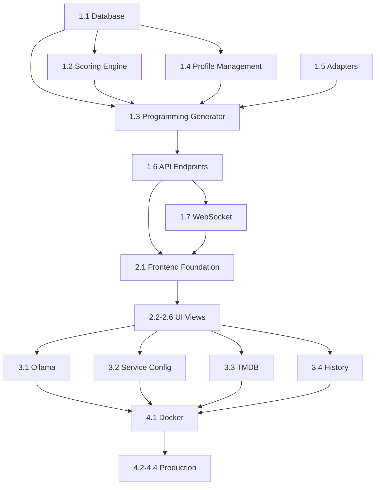

# Implementation Plan: SmartTunarr

**Feature Branch**: `001-tv-channel-programming`
**Created**: 2026-01-27
**Status**: Ready for Implementation

## Technical Context

### Technology Stack

| Layer | Technology | Version | Rationale |
|-------|------------|---------|-----------|
| Backend | Python + FastAPI | 3.11+ / 0.109+ | Async support, Pydantic validation, auto OpenAPI |
| Frontend | Vue.js + TypeScript | 3.4+ / 5.3+ | Composition API, strong typing, i18n support |
| Database | SQLite + WAL | 3.40+ | Single container, 30K+ records, JSON1 extension |
| Real-time | WebSocket | Native | Progress updates during programming |

### External Integrations

| Service | Protocol | Authentication | Rate Limit |
|---------|----------|----------------|------------|
| Tunarr | REST API | Basic/None | None |
| Plex | PlexAPI SDK | Token | None |
| TMDB | REST API | API Key | 40 req/10s |
| Ollama | REST API | None (local) | None |

### Constraints

- Single Docker container (FR-070)
- Configuration via environment variables (FR-071)
- UI response < 200ms, programming < 2min (SC-001, SC-007)
- Profile v4 backward compatibility (SC-006)

## Architecture Overview

```
┌─────────────────────────────────────────────────────────────────┐
│                         Frontend (Vue.js)                        │
│  ┌──────────┐ ┌──────────┐ ┌──────────┐ ┌──────────┐ ┌────────┐ │
│  │Programming│ │ Scoring  │ │ Profiles │ │ History  │ │Settings│ │
│  └────┬─────┘ └────┬─────┘ └────┬─────┘ └────┬─────┘ └───┬────┘ │
└───────┼────────────┼────────────┼────────────┼───────────┼──────┘
        │            │            │            │           │
        ▼            ▼            ▼            ▼           ▼
┌─────────────────────────────────────────────────────────────────┐
│                      REST API + WebSocket                        │
└─────────────────────────────────────────────────────────────────┘
        │
        ▼
┌─────────────────────────────────────────────────────────────────┐
│                        Backend (FastAPI)                         │
│  ┌────────────────────────────────────────────────────────────┐ │
│  │                        Core Layer                           │ │
│  │  ┌─────────────┐  ┌─────────────┐  ┌─────────────────────┐ │ │
│  │  │   Scoring   │  │ Programming │  │   Time Block Mgr    │ │ │
│  │  │   Engine    │  │  Generator  │  │                     │ │ │
│  │  │ (9 criteria)│  │ (N iter)    │  │ (midnight support)  │ │ │
│  │  └─────────────┘  └─────────────┘  └─────────────────────┘ │ │
│  └────────────────────────────────────────────────────────────┘ │
│  ┌────────────────────────────────────────────────────────────┐ │
│  │                      Adapter Layer                          │ │
│  │  ┌──────────┐  ┌──────────┐  ┌──────────┐  ┌────────────┐ │ │
│  │  │  Tunarr  │  │   Plex   │  │   TMDB   │  │   Ollama   │ │ │
│  │  │ Adapter  │  │ Adapter  │  │ Adapter  │  │  Adapter   │ │ │
│  │  └──────────┘  └──────────┘  └──────────┘  └────────────┘ │ │
│  └────────────────────────────────────────────────────────────┘ │
│  ┌────────────────────────────────────────────────────────────┐ │
│  │                      Data Layer                             │ │
│  │  ┌─────────────────────────────────────────────────────┐   │ │
│  │  │               SQLite (WAL mode)                      │   │ │
│  │  │  Profiles | Content | Channels | History | Services  │   │ │
│  │  └─────────────────────────────────────────────────────┘   │ │
│  └────────────────────────────────────────────────────────────┘ │
└─────────────────────────────────────────────────────────────────┘
```

## Implementation Phases

### Phase 1: Core Foundation (P1 Features)

**Goal**: Enable JSON profile-based programming and scoring

#### 1.1 Database & Models

- [ ] SQLite database setup with WAL mode
- [ ] SQLAlchemy models: Profile, Content, ContentMeta, Channel, Program, ScoringResult, HistoryEntry, Service
- [ ] Database migrations setup
- [ ] JSON1 extension for metadata queries

#### 1.2 Scoring Engine

- [ ] BaseCriterion abstract class
- [ ] 9 criterion implementations:
  - TypeCriterion (content type matching)
  - DurationCriterion (duration fit in block)
  - GenreCriterion (genre preference matching)
  - TimingCriterion (time block assignment)
  - StrategyCriterion (sequence/insertion rules)
  - AgeCriterion (age rating compliance)
  - RatingCriterion (TMDB rating thresholds)
  - FilterCriterion (keyword/studio filters)
  - BonusCriterion (contextual bonuses)
- [ ] ScoringEngine orchestrator with weighted aggregation
- [ ] Deterministic scoring (reproducibility)
- [ ] Unit tests with >80% coverage

#### 1.3 Programming Generator

- [ ] Iterative generation with configurable N
- [ ] Random seed for reproducibility
- [ ] Best-score selection
- [ ] Forbidden content exclusion
- [ ] Mandatory content enforcement with penalties
- [ ] Time block assignment
- [ ] Checkpoint-based recovery for connection loss

#### 1.4 Profile Management

- [ ] JSON Schema v5.0 definition
- [ ] Pydantic validation models
- [ ] v4 compatibility layer (migration)
- [ ] Import/Export endpoints
- [ ] Validation endpoint (without save)

#### 1.5 External Service Adapters

- [ ] TunarrAdapter: GET/PUT channels and programming
- [ ] PlexAdapter: Library listing, content metadata
- [ ] Metadata modes: cache-only, TMDB-only, cache+TMDB, Plex-only

#### 1.6 API Endpoints (Phase 1)

- [ ] POST /programming/generate
- [ ] GET /programming/jobs/{id}
- [ ] POST /programming/jobs/{id}/apply
- [ ] POST /scoring/analyze
- [ ] POST /scoring/export
- [ ] CRUD /profiles
- [ ] GET /channels
- [ ] POST /channels/{id}/sync

#### 1.7 WebSocket Progress

- [ ] Connection management
- [ ] Iteration progress events
- [ ] Score updates in real-time

### Phase 2: User Interface (P1 + P2 Features)

**Goal**: Complete web interface with visualization

#### 2.1 Frontend Foundation

- [ ] Vue.js 3 project setup with TypeScript
- [ ] Pinia stores: programming, profiles, channels, settings
- [ ] API service layer with axios
- [ ] WebSocket client for progress
- [ ] Router configuration

#### 2.2 Programming View

- [ ] Channel selector
- [ ] Profile selector
- [ ] Iteration/randomness configuration
- [ ] Start/Cancel buttons
- [ ] Progress indicator
- [ ] Result preview with scores

#### 2.3 Scoring View

- [ ] Channel selector for analysis
- [ ] Profile selector for criteria
- [ ] Score breakdown table
- [ ] Violation highlighting (red)
- [ ] Export button (CSV/JSON)

#### 2.4 Program Visualization

- [ ] Timeline component
- [ ] Block visualization with colors
- [ ] Score color coding (green-yellow-red)
- [ ] Hover details (score breakdown)
- [ ] Time markers (HH:MM)

#### 2.5 Profile Management UI

- [ ] Profile list with labels filter
- [ ] Profile editor (JSON or form)
- [ ] Import/Export buttons
- [ ] Label management
- [ ] Default parameters

#### 2.6 Theme & i18n

- [ ] Light/Dark/System theme support
- [ ] CSS variables for theming
- [ ] French and English translations
- [ ] Language switcher

### Phase 3: Advanced Features (P2 Features)

**Goal**: AI integration, service configuration, history

#### 3.1 Ollama Integration

- [ ] OllamaAdapter with ollama-python SDK
- [ ] Profile generation from natural language
- [ ] JSON validation with retry (3 attempts)
- [ ] Prompt templates with examples
- [ ] Generation history

#### 3.2 Service Configuration UI

- [ ] Services settings page
- [ ] Connection test for each service
- [ ] Plex library browser
- [ ] Ollama model selector
- [ ] Credential encryption at rest

#### 3.3 TMDB Enrichment

- [ ] TMDBAdapter with rate limiting
- [ ] Batch enrichment for cache population
- [ ] Incremental updates
- [ ] Cache integrity check

#### 3.4 History & Logs

- [ ] History list with filters
- [ ] History detail view
- [ ] Log viewer in settings
- [ ] Log level configuration

### Phase 4: Production Ready (P3 + Infrastructure)

**Goal**: Docker deployment, performance, polish

#### 4.1 Docker Configuration

- [ ] Multi-stage Dockerfile (build frontend, serve with backend)
- [ ] Volume mounts for SQLite and logs
- [ ] Environment variable configuration
- [ ] Health check endpoint

#### 4.2 Performance Optimization

- [ ] Database indexing
- [ ] Query optimization for 30K+ content
- [ ] Frontend bundle optimization
- [ ] Caching strategy for metadata

#### 4.3 Documentation

- [ ] README with setup instructions
- [ ] Docker deployment guide
- [ ] API documentation (auto-generated)
- [ ] Profile schema documentation

#### 4.4 Testing & Quality

- [ ] Integration tests for API
- [ ] E2E tests for critical flows
- [ ] Performance benchmarks
- [ ] Security review (credential handling)

## Risk Mitigation

| Risk | Impact | Mitigation |
|------|--------|------------|
| Tunarr API changes | High | Abstract via adapter, version check |
| TMDB rate limit | Medium | Local cache, batch processing |
| Scoring performance | Medium | Optimize hot paths, profile 30K content |
| v4 profile incompatibility | Medium | Migration layer with validation |
| Ollama unavailable | Low | Feature is optional (P2) |

## Success Metrics

| Metric | Target | Validation |
|--------|--------|------------|
| Programming 24h/10iter | < 2 min | Performance test |
| Cache 30K films | No degradation | Load test |
| UI response | < 200ms | Lighthouse |
| Score reproducibility | 100% | Unit tests |
| Forbidden compliance | 100% | Integration tests |
| Test coverage (scoring) | > 80% | Coverage report |

## Dependencies



## Related Documents

- [Feature Specification](./spec.md)
- [Data Model](./data-model.md)
- [API Contracts](./contracts/openapi.yaml)
- [Research Decisions](./research.md)
- [Quickstart Guide](./quickstart.md)
